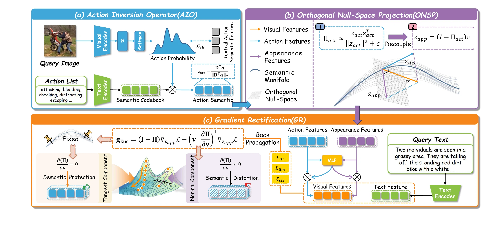

<p align="center">
  <a href="https://rainy-london.github.io/LightAIR/">
    
  </a>
</p>

<h1 align="center">LightAIR: Lightweight Action Inversion and Riemannian Rectification for Text-based Person Anomaly Search</h1>

<p align="center">
  <a href="https://rainy-london.github.io/">Yulun Zhang</a>,
  <a href="https://lee-zixu.github.io/">Zixu Li</a><sup>&dagger;</sup>,
  <a href="https://zivchen-ty.github.io/">Zhiwei Chen</a>,
  <a href="https://zhihfu.github.io/">Zhiheng Fu</a>,
  Wenbo Wang,
  Zihang Qiu,
  Zhilin Wang,
  <a href="https://mathwrx.github.io/">Ruxin Wang</a><sup>&#9993;</sup>,
  <a href="https://faculty.sdu.edu.cn/huyupeng/en/index.htm">Yupeng Hu</a>
</p>

<p align="center">
  <sup>&dagger;</sup> Project leader &nbsp;&nbsp; <sup>&#9993;</sup> Corresponding author
</p>

<p align="center">
  <a href="https://rainy-london.github.io/LightAIR/"></a>
  <a href="https://arxiv.org/abs/2608.09152"></a>
  <a href="https://doi.org/10.1145/3767308.3835461"></a>
  
</p>

Official PyTorch implementation of **LightAIR**, accepted by the 34th ACM International Conference on Multimedia (ACM MM 2026).

LightAIR addresses two central difficulties in Text-based Person Anomaly Search (TPAS): visual action-appearance entanglement and shortcut learning on hard negatives. It introduces textual action semantics as anchors, geometrically separates appearance from the action subspace, and constrains optimization to preserve that separation.

## News

- **2026-08-11:** Project page and initial public code release.
- **2026-08-10:** The paper became available on [arXiv](https://arxiv.org/abs/2608.09152).
- **2026-07-10:** LightAIR was accepted by ACM Multimedia 2026.

## Method

LightAIR contains three main components:

1. **Action Inversion Operator (AIO):** builds a frozen text-derived action codebook and reconstructs action features with a sparse top-k mixture.
2. **Orthogonal Null-Space Projection (ONSP):** projects visual representations into the orthogonal complement of the action direction to obtain appearance features.
3. **Gradient Rectification (GR):** uses an entropy-guided Riemannian projection to prevent harmful updates from distorting the action semantic manifold.

The final retrieval representation adaptively aggregates action and appearance features for cross-modal matching.

<p align="center">
  
</p>

## Results

Selected results reported in the paper:

| Benchmark | Setting | R@1 | R@5 | R@10 | mAP / Avg. Recall |
| --- | --- | ---: | ---: | ---: | ---: |
| PAB | 0.1M | 84.73 | 99.65 | 99.85 | 91.93 mAP |
| PAB | 1M | 85.49 | 99.65 | 99.99 | 92.20 mAP |
| MultiWeather | Mean | 68.87 | - | - | 79.69 mAP |
| UCC OOD | 1M | 63.27 | 78.63 | 86.76 | 52.25 mAP |
| UFine3C | TIPR | - | - | - | 83.32 Avg. Recall |

See the [paper](https://arxiv.org/abs/2608.09152) for complete TPAS, TIPR, robustness, ablation, and qualitative results.

## Installation

We recommend Linux, Python 3.10, an NVIDIA GPU, and a CUDA-enabled PyTorch installation.

```bash
conda create -n lightair python=3.10 -y
conda activate lightair

# Install the PyTorch build matching your CUDA environment first.
# Example for CUDA 12.1:
pip install torch==2.1.0 torchvision==0.16.0 torchaudio==2.1.0 \
  --index-url https://download.pytorch.org/whl/cu121

pip install -r requirements.txt
python -m nltk.downloader wordnet
```

The training loop uses native BF16 on Ampere-or-newer GPUs and FP16 AMP on older CUDA GPUs such as V100.

## Data Preparation

Download the PAB dataset from the [CMP repository](https://github.com/Shuyu-XJTU/CMP) and place or link it at `PAB/`:

```text
LightAIR/
└── PAB/
    ├── annotation/
    │   ├── train/
    │   ├── test/
    │   └── multi-weather/
    ├── train/
    ├── test/
    ├── ucc/
    └── pose/
```

The default PAB paths are defined in `configs/tpas_X2VLM.yaml`. Update `image_root`, `train_file`, and `test_file` if your dataset lives elsewhere.

## Pretrained Backbone

Download the **X2VLM-base (1B)** checkpoint from the [official X2-VLM repository](https://github.com/zengyan-97/X2-VLM#checkpoints) and place it at:

```text
checkpoint/x2vlm_base_1b.th
```

## Training

Run commands from the repository root.

Single GPU:

```bash
python run_TPS.py \
  --task tpas \
  --dist gpu0 \
  --checkpoint checkpoint/x2vlm_base_1b.th \
  --output_dir output/lightair
```

Four GPUs:

```bash
python run_TPS.py \
  --task tpas \
  --dist f4 \
  --checkpoint checkpoint/x2vlm_base_1b.th \
  --output_dir output/lightair
```

The best checkpoint is selected by R@1 and saved as `output/lightair/checkpoint_best.pth`.

## Evaluation

```bash
python run_TPS.py \
  --task tpas \
  --evaluate \
  --dist gpu0 \
  --checkpoint output/lightair/checkpoint_best.pth \
  --output_dir output/lightair_eval
```

The TPAS evaluation path covers the configured PAB, UCC, and MultiWeather splits. Ensure the corresponding annotation files exist, or edit the test split list in `Search_TPS_X2VLM.py`.

## Configuration

Paper-aligned defaults live in `configs/tpas_X2VLM.yaml`.

| Option | Default | Description |
| --- | ---: | --- |
| `batch_size_train` | `22` | Per-process training batch size |
| `optimizer.lr` | `2e-5` | AdamW learning rate |
| `schedular.epochs` | `20` | Training epochs |
| `top_k` | `3` | Active action anchors |
| `action_temp` | `0.1` | Sparse action-distribution temperature |
| `entropy_tau` | `1.0` | Entropy scale for gradient rectification |
| `itm_weight` | `4.0` | Image-text matching loss weight |
| `cls_weight` | `1.0` | Action-semantic supervision weight |
| `action_mapper_input` | `projected` | Input representation for action inversion |
| `cls_target` | `query` | Target used for action-semantic alignment |

Command-line flags in `run_TPS.py` can override the most common training options.

## Repository Structure

```text
LightAIR/
├── assets/                    # Project logo
├── configs/                   # TPAS and TIPR configurations
├── dataset/                   # Training and evaluation datasets
├── dataset_TPS/               # TPAS-specific dataset utilities
├── models/                    # X2-VLM backbone and LightAIR modules
├── static/                    # Project-page assets, styles, and scripts
├── Search_TPS_X2VLM.py        # Main training/evaluation program
├── run_TPS.py                 # Distributed launch wrapper
├── train.py                   # Training loops
├── eval_TPS.py                # TPAS retrieval evaluation
├── action_list.json           # Auxiliary offline action vocabulary
├── index.html                 # GitHub Pages project page
└── requirements.txt
```

## License and Third-Party Notices

A project-wide license has not yet been declared for LightAIR-specific contributions.
Third-party components remain under their respective licenses; see
[THIRD_PARTY_NOTICES.md](THIRD_PARTY_NOTICES.md) for the component mapping and
the license texts stored under `LICENSES/`.

## Acknowledgements

This implementation builds on [X2-VLM](https://github.com/zengyan-97/X2-VLM). We thank its authors for releasing the model and pretrained checkpoints. We also thank the authors of [CMP/PAB](https://github.com/Shuyu-XJTU/CMP) for introducing TPAS and releasing the benchmark.

## Citation

```bibtex
@article{zhang2026lightair,
  title   = {LightAIR: Lightweight Action Inversion and Riemannian Rectification for Text-based Person Anomaly Search},
  author  = {Zhang, Yulun and Li, Zixu and Chen, Zhiwei and Fu, Zhiheng and Wang, Wenbo and Qiu, Zihang and Wang, Zhilin and Wang, Ruxin and Hu, Yupeng},
  journal = {arXiv preprint arXiv:2608.09152},
  year    = {2026},
  url     = {https://arxiv.org/abs/2608.09152}
}
```

For questions and bug reports, please use [GitHub Issues](https://github.com/rainy-london/LightAIR/issues).
