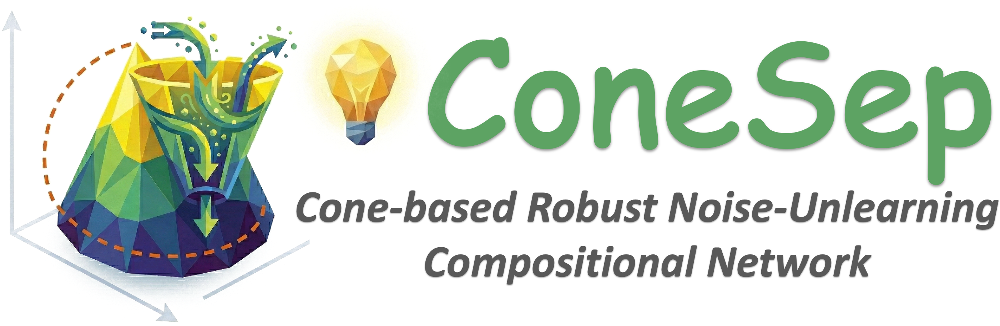
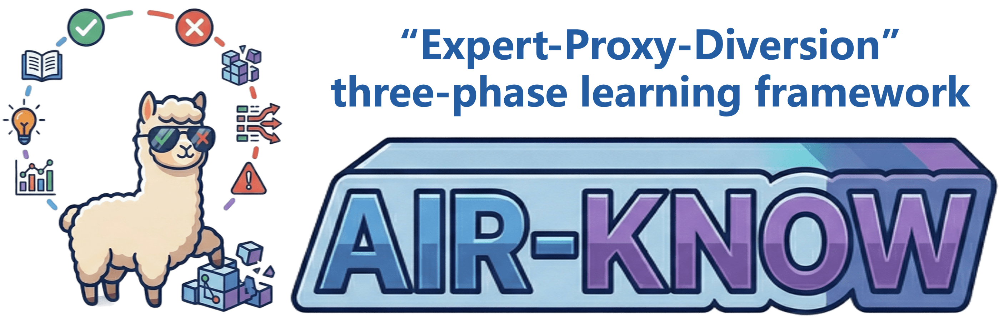
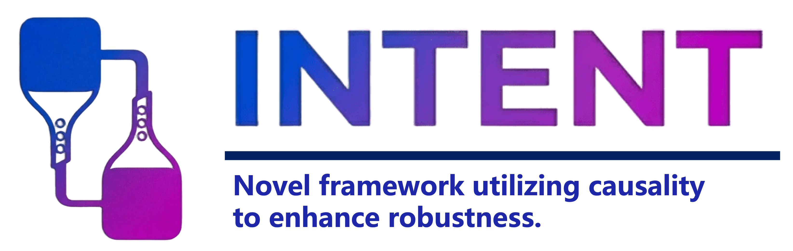
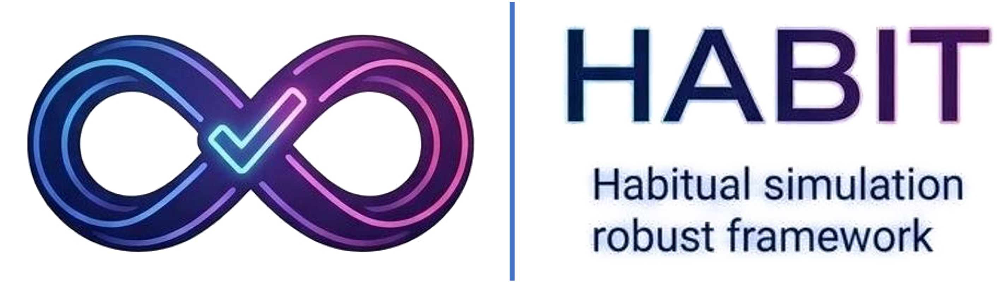
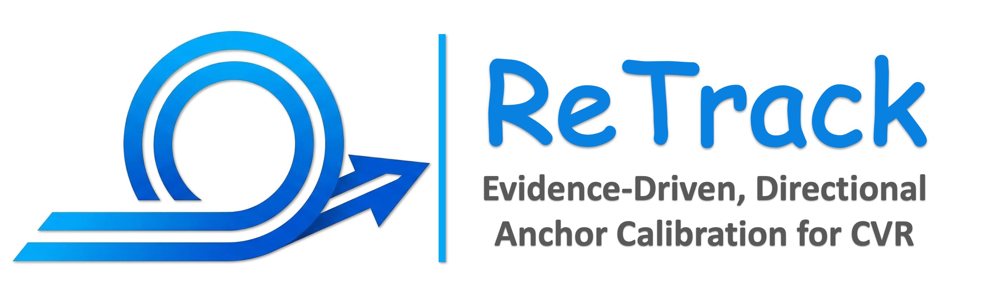
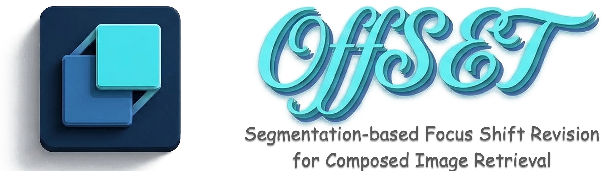
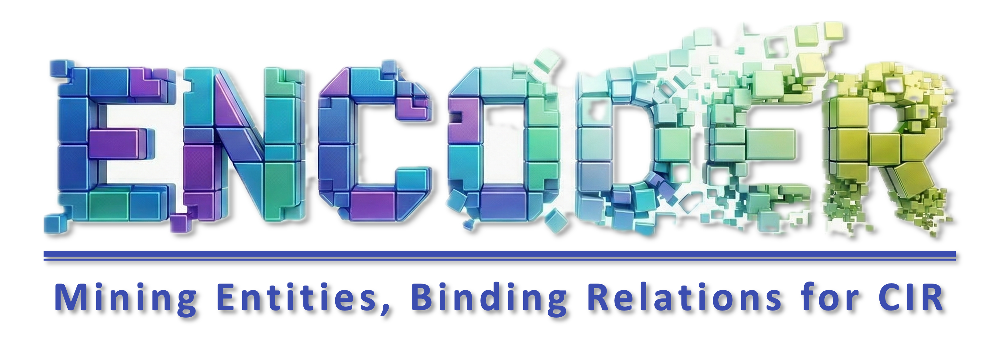

<p align="center">
  
</p>

<h1 align="center">[ACM MM 2026] LightAIR: Lightweight Action Inversion and Riemannian Rectification for Text-based Person Anomaly Search</h1>

<p align="center">
  <a href="https://rainy-london.github.io/">Yulun Zhang</a>,
  <a href="https://lee-zixu.github.io/">Zixu Li</a><sup>&dagger;</sup>,
  <a href="https://zivchen-ty.github.io/">Zhiwei Chen</a>,
  <a href="https://zhihfu.github.io/">Zhiheng Fu</a>,
  Wenbo Wang,
  Zihang Qiu,
  Zhilin Wang,
  <a href="https://mathwrx.github.io/">Ruxin Wang</a><sup>&#9993;</sup>,
  <a href="https://faculty.sdu.edu.cn/huyupeng/en/index.htm">Yupeng Hu</a>
</p>

<p align="center">
  <sup>&dagger;</sup> Project leader &nbsp;&nbsp; <sup>&#9993;</sup> Corresponding author
</p>

<p align="center">
  <a href="https://arxiv.org/abs/2608.09152">
  <a href="https://zhihfu.github.io/"></a>
  <a href="https://pytorch.org/get-started/locally/"></a>
  
</p>

This repository provides the official PyTorch implementation of **LightAIR**, accepted by ACM Multimedia 2026. LightAIR is designed for **Text-based Person Anomaly Search (TPAS)**, where a natural-language query is used to retrieve people exhibiting routine or anomalous behaviors from a large image gallery.

> This codebase is intended for academic research. The public paper, pretrained LightAIR checkpoint, framework figure, and complete result tables will be added when they are available.

## 📌 Introduction

Text-based person anomaly search requires a model to distinguish subtle behavioral differences while retaining appearance and identity cues. These semantics are often entangled in a single visual representation, making fine-grained retrieval difficult.

LightAIR addresses this problem with two lightweight components. **Action Inversion** predicts a sparse distribution over a frozen action-semantic codebook and reconstructs the action component of each visual feature. **Riemannian Rectification** then uses the reconstructed action direction and its uncertainty to rectify the normalized representation. A learned semantic gate recomposes action and residual appearance information for cross-modal retrieval.

The implementation is built on [X2-VLM](https://github.com/zengyan-97/X2-VLM) and is evaluated on the [Pedestrian Anomaly Behavior (PAB)](https://github.com/Shuyu-XJTU/CMP) benchmark.

## 📢 News

- **[2026-08-11]** Initial training and evaluation code release.
- **[2026-07-10]** LightAIR was accepted by ACM Multimedia 2026.

## ✨ Key Features

- **Lightweight Action Inversion:** constructs a frozen text-derived action codebook and estimates a sparse top-k action mixture from each visual representation.
- **Uncertainty-aware Rectification:** uses action-distribution entropy to control feature rectification in the normalized embedding space.
- **Adaptive Semantic Recomposition:** learns separate gates for reconstructed action semantics and residual appearance semantics.
- **Fine-grained TPAS Training:** combines image-text contrastive learning, image-text matching, action-consistency supervision, text augmentation, and identity-based hard negatives.
- **Complete Retrieval Evaluation:** reports R@1, R@5, R@10, mAP, and mINP on the standard PAB protocol and the configured robustness splits.

## 🏗️ Method Overview

```text
Person image
    |
    v
X2-VLM visual encoder
    |
    +--> sparse top-k action prediction --> frozen action codebook --> action feature
    |                                                                   |
    +---------------- uncertainty-aware Riemannian rectification <------+
                                |
                                v
                  residual appearance feature
                                |
                                v
              gated action/appearance recomposition
                                |
                                v
                 final cross-modal retrieval feature
```

The main implementation is located in:

- `submission/models/xvlm.py`: action codebook, action inversion, entropy-aware rectification, and semantic recomposition.
- `submission/models/model_X2VLM.py`: LightAIR forward pass and training objectives.
- `submission/dataset/search_dataset.py`: PAB annotations, action labels, text augmentation, and hard-negative samples.

## 🚀 Experimental Results

The complete quantitative results, framework visualization, and pretrained LightAIR checkpoint will be released together with the public paper.

## Table of Contents

- [Installation](#-installation)
- [Data Preparation](#-data-preparation)
- [Pretrained Model](#-pretrained-model)
- [Quick Start](#-quick-start)
- [Configuration](#-configuration)
- [Project Structure](#-project-structure)
- [Implementation Notes](#-implementation-notes)
- [Acknowledgements](#-acknowledgements)
- [Related Projects](#-related-projects)
- [Citation](#-citation)

## 📦 Installation

We recommend Linux, an NVIDIA GPU with bfloat16 support, CUDA 11.8 or later, and Conda.

```bash
conda create -n lightair python=3.10 -y
conda activate lightair

cd submission

# Example for CUDA 12.1. Select the PyTorch build matching your CUDA setup.
pip install torch==2.1.0 torchvision==0.16.0 torchaudio==2.1.0 \
  --index-url https://download.pytorch.org/whl/cu121

pip install -r requirements.txt
python -m nltk.downloader wordnet
```

The tokenizer is initialized from `bert-base-uncased`. Hugging Face will download it automatically unless it is already available in the local cache.

## 📂 Data Preparation

Download PAB from its [official CMP repository](https://github.com/Shuyu-XJTU/CMP). From the repository root, place or symlink the dataset at `submission/PAB` so that the default configuration resolves the following paths:

```text
submission/
└── PAB/
    ├── annotation/
    │   ├── train/
    │   │   ├── attr_0.json
    │   │   ├── attr_1.json
    │   │   └── ...
    │   ├── test/
    │   │   ├── attr.json
    │   │   └── ucc.json
    │   └── multi-weather/          # Required by the full --evaluate suite
    │       ├── multi-weather_wind.json
    │       ├── multi-weather_rain.json
    │       └── ...
    ├── train/
    │   ├── imgs_0/
    │   ├── imgs_1/
    │   └── ...
    ├── test/
    ├── ucc/
    └── pose/                       # Not used by the default LightAIR setting
```

PAB annotation files are read as line-delimited JSON. Training samples should contain `image`, `caption`, `image_id`, `hard_i`, `hard_c`, `hard_i_id`, and either `normal` or `anomaly`. Test samples should contain `image`, `image_id`, and a list-valued `caption` field.

To use a different dataset location, update `image_root`, `train_file`, and `test_file` in `submission/configs/tpas_X2VLM.yaml`.

## 💾 Pretrained Model

Download the **X2VLM-base (1B)** checkpoint from the [official X2-VLM repository](https://github.com/zengyan-97/X2-VLM#checkpoints) and organize it as follows:

```text
submission/
└── checkpoint/
    └── x2vlm_base_1b.th
```

The released LightAIR checkpoint should also be placed in this directory when it becomes available.

## 🚀 Quick Start

Run all commands from `submission/`.

### Training

Single-GPU training on GPU 0:

```bash
python run_TPS.py \
  --task tpas \
  --dist gpu0 \
  --checkpoint checkpoint/x2vlm_base_1b.th \
  --output_dir output/lightair
```

Four-GPU distributed training on GPUs 0-3:

```bash
python run_TPS.py \
  --task tpas \
  --dist f4 \
  --checkpoint checkpoint/x2vlm_base_1b.th \
  --output_dir output/lightair
```

The best checkpoint is selected by R@1 and saved as `output/lightair/checkpoint_best.pth`. The resolved configuration and epoch logs are written to the same output directory.

### Evaluation

```bash
python run_TPS.py \
  --task tpas \
  --evaluate \
  --dist gpu0 \
  --checkpoint output/lightair/checkpoint_best.pth \
  --output_dir output/lightair_eval
```

The direct evaluation entry evaluates the original PAB test set, UCC, and the multi-weather splits listed in `Search_TPS_X2VLM.py`. Make sure those annotation files are available, or adjust `test_file_list` to the subset you want to evaluate.

## ⚙️ Configuration

The paper-aligned defaults are defined in `submission/configs/tpas_X2VLM.yaml` and can be overridden from the launcher where indicated.

| Option | Default | Description |
| --- | ---: | --- |
| `batch_size_train` | `22` | Per-process training batch size. Override with `--bs`. |
| `optimizer.lr` | `2e-5` | AdamW learning rate. Override with `--lr`. |
| `schedular.epochs` | `20` | Number of training epochs. Override with `--epo`. |
| `top_k` | `3` | Number of active action anchors. Override with `--top_k`. |
| `action_temp` | `0.1` | Temperature for the sparse action distribution. |
| `entropy_tau` | `1.0` | Entropy scale used by rectification. |
| `itm_weight` | `4.0` | Weight of the image-text matching objective. |
| `cls_weight` | `1.0` | Weight of action-consistency supervision. |
| `action_mapper_input` | `projected` | Predict actions from the shared projected visual feature. |
| `cls_target` | `query` | Align the reconstructed action feature with the query representation. |

For two-GPU training use `--dist f2`. For a specific single GPU use `--dist gpuN`, for example `--dist gpu3`.

## 📁 Project Structure

```text
LightAIR/
├── README.md
└── submission/
    ├── configs/
    │   └── tpas_X2VLM.yaml        # Default LightAIR/PAB configuration
    ├── dataset/
    │   └── search_dataset.py      # PAB training and evaluation datasets
    ├── models/
    │   ├── model_X2VLM.py         # LightAIR model and objectives
    │   └── xvlm.py                # Action inversion and rectification
    ├── Search_TPS_X2VLM.py        # Main training/evaluation program
    ├── run_TPS.py                 # Single-node distributed launcher
    ├── train.py                   # Training loop
    ├── eval_TPS.py                # TPAS retrieval metrics and reranking
    ├── action_list.json           # Auxiliary offline action vocabulary
    └── requirements.txt
```

## 🔎 Implementation Notes

- The runtime action vocabulary contains 875 entries embedded in `tpas_X2VLM.yaml`. It initializes a frozen text-derived action codebook on the first forward pass.
- `action_list.json`, `extract.py`, and `extract-v2.py` are auxiliary files for offline action-vocabulary construction; the training path does not load `action_list.json` directly.
- The default method uses `action_mapper_input: projected` and `cls_target: query`, matching the released formulation.
- `eda: True` enables text augmentation and `be_hard: True` enables PAB identity-based hard-negative training. Pose images are disabled by default.
- The TPAS loop optimizes the returned contrastive/action-consistency loss and weighted matching loss. MLM loss is computed by the model but is not added to the final TPAS training loss.
- TensorFlow is optional and is only required by inherited checkpoint-conversion utilities.

## 🙏 Acknowledgements

This implementation builds on [X2-VLM](https://github.com/zengyan-97/X2-VLM). We thank its authors for releasing the model and pretrained checkpoints. We also thank the authors of [CMP/PAB](https://github.com/Shuyu-XJTU/CMP) for introducing the TPAS task and releasing the benchmark.

## 🔗 Related Projects

*Ecosystem & Other Works from our Team*


<table style="width:100%; border:none; text-align:center; background-color:transparent;">
  <tr style="border:none;">
    <td style="width:30%; border:none; vertical-align:top; padding-top:30px;">
      <br>
      <b>COMBINER (TIP'26)</b><br>
      <span style="font-size: 0.9em;">
        <a href="https://arxiv.org/abs/2606.04604" target="_blank">Paper</a> | 
        <a href="https://lee-zixu.github.io/COMBINER.github.io/" target="_blank">Project</a> | 
        <a href="https://github.com/iLearn-Lab/TIP26-COMBINER" target="_blank">Code</a> 
      </span>
    </td>
      <td style="width:30%; border:none; vertical-align:top; padding-top:30px;">
      <br>
      <b>TEMA (ACL'26)</b><br>
      <span style="font-size: 0.9em;">
        <a href="https://arxiv.org/abs/2604.21806" target="_blank">Paper</a> | 
        <a href="https://lee-zixu.github.io/TEMA.github.io/" target="_blank">Project</a> | 
        <a href="https://github.com/Lee-zixu/ACL26-TEMA" target="_blank">Code</a> 
      </span>
    </td>
    <td style="width:30%; border:none; vertical-align:top; padding-top:30px;">
      <br>
      <b>ConeSep (CVPR'26)</b><br>
      <span style="font-size: 0.9em;">
        <a href="https://arxiv.org/abs/2604.20358" target="_blank">Paper</a> | 
        <a href="https://lee-zixu.github.io/ConeSep.github.io/" target="_blank">Project</a> | 
        <a href="https://github.com/Lee-zixu/ConeSep" target="_blank">Code</a>
      </span>
    </td>  
          </tr>
    <tr style="border:none;">
    <td style="width:30%; border:none; vertical-align:top; padding-top:30px;">
      <br>
      <b>Air-Know (CVPR'26)</b><br>
      <span style="font-size: 0.9em;">
        <a href="http://arxiv.org/abs/2604.19386" target="_blank">Paper</a> | 
        <a href="https://zhihfu.github.io/Air-Know.github.io/" target="_blank">Project</a> | 
        <a href="https://github.com/ZhihFu/Air-Know" target="_blank">Code</a>
      </span>
    </td>  
    <td style="width:30%; border:none; vertical-align:top; padding-top:30px;">
      <br>
      <b>INTENT (AAAI'26)</b><br>
      <span style="font-size: 0.9em;">
        <a href="https://ojs.aaai.org/index.php/AAAI/article/view/39181" target="_blank">Paper</a> |
        <a href="https://zivchen-ty.github.io/INTENT.github.io/" target="_blank">Project</a> | 
        <a href="https://github.com/ZivChen-Ty/INTENT" target="_blank">Code</a> 
      </span>
    </td>  
    <td style="width:30%; border:none; vertical-align:top; padding-top:30px;">
      <br>
      <b>HABIT (AAAI'26)</b><br>
      <span style="font-size: 0.9em;">
        <a href="https://ojs.aaai.org/index.php/AAAI/article/view/37608" target="_blank">Paper</a> |
        <a href="https://lee-zixu.github.io/HABIT.github.io/" target="_blank">Project</a> | 
        <a href="https://github.com/Lee-zixu/HABIT" target="_blank">Code</a>
      </span>
    </td>
        </tr>
    <tr style="border:none;">
    <td style="width:30%; border:none; vertical-align:top; padding-top:30px;">
      <br>
      <b>ReTrack (AAAI'26)</b><br>
      <span style="font-size: 0.9em;">
        <a href="https://ojs.aaai.org/index.php/AAAI/article/view/39507" target="_blank">Paper</a> |
        <a href="https://lee-zixu.github.io/ReTrack.github.io/" target="_blank">Project</a> | 
        <a href="https://github.com/Lee-zixu/ReTrack" target="_blank">Code</a> |
      </span>
    </td>
    <td style="width:30%; border:none; vertical-align:top; padding-top:30px;">
      <br>
      <b>HUD (ACM MM'25)</b><br>
      <span style="font-size: 0.9em;">
        <a href="https://dl.acm.org/doi/10.1145/3746027.3755445" target="_blank">Paper</a> |
        <a href="https://zivchen-ty.github.io/HUD.github.io/" target="_blank">Project</a> | 
        <a href="https://github.com/ZivChen-Ty/HUD" target="_blank">Code</a> |
      </span>
    </td>
    <td style="width:30%; border:none; vertical-align:top; padding-top:30px;">
      <br>
      <b>OFFSET (ACM MM'25)</b><br>
      <span style="font-size: 0.9em;">
        <a href="https://dl.acm.org/doi/10.1145/3746027.3755366" target="_blank">Paper</a> |
        <a href="https://zivchen-ty.github.io/OFFSET.github.io/" target="_blank">Project</a> | 
        <a href="https://github.com/ZivChen-Ty/OFFSET" target="_blank">Code</a>
      </span>
    </td>
        </tr>
        <tr style="border:none;">
    <td style="width:30%; border:none; vertical-align:top; padding-top:30px;">
      <br>
      <b>ENCODER (AAAI'25)</b><br>
      <span style="font-size: 0.9em;">
        <a href="https://ojs.aaai.org/index.php/AAAI/article/view/32541" target="_blank">Paper</a> |
        <a href="https://sdu-l.github.io/ENCODER.github.io/" target="_blank">Project</a> | 
        <a href="https://github.com/Lee-zixu/ENCODER" target="_blank">Code</a>
      </span>
    </td>
  </tr>
</table>

## 📝 Citation

If you find LightAIR useful in your research, please consider citing our work. This preliminary entry will be replaced by the official ACM BibTeX after publication.

```bibtex
@article{zhang2026lightair,
  title   = {LightAIR: Lightweight Action Inversion and Riemannian Rectification for Text-based Person Anomaly Search},
  author  = {Zhang, Yulun and Li, Zixu and Chen, Zhiwei and Fu, Zhiheng and Wang, Wenbo and Qiu, Zihang and Wang, Zhilin and Wang, Ruxin and Hu, Yupeng},
  journal = {arXiv preprint arXiv:2608.09152},
  year    = {2026},
  url     = {https://arxiv.org/abs/2608.09152}
}
```

For questions or bug reports, please open a GitHub issue. Updates to the paper and project resources will also be posted on the [author homepage](https://rainy-london.github.io/).
